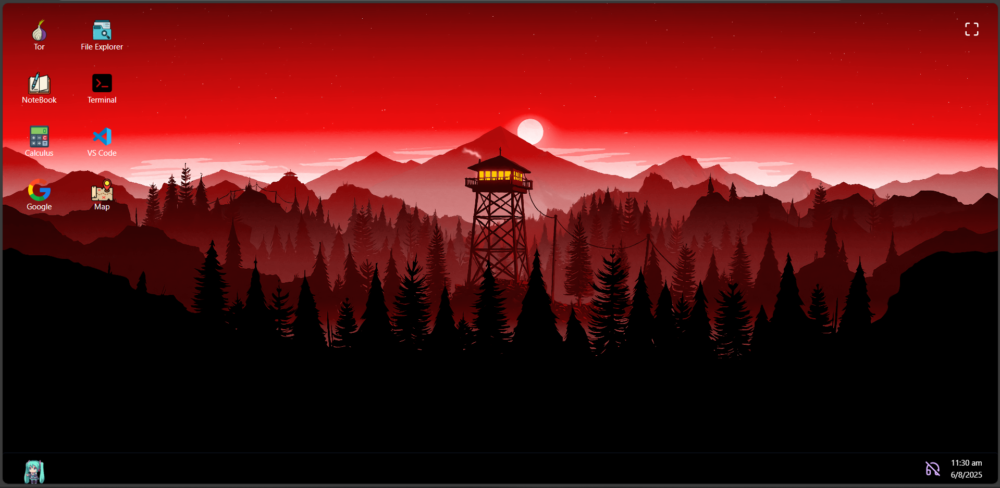

## VoidOS — A Browser-Based Operating System Simulator

VoidOS is a fully interactive desktop-like operating system simulator built entirely using ReactJS. It mimics the look and feel of a real OS inside your browser, featuring animated UI components, windowed applications, and a terminal system with real-time commands.

